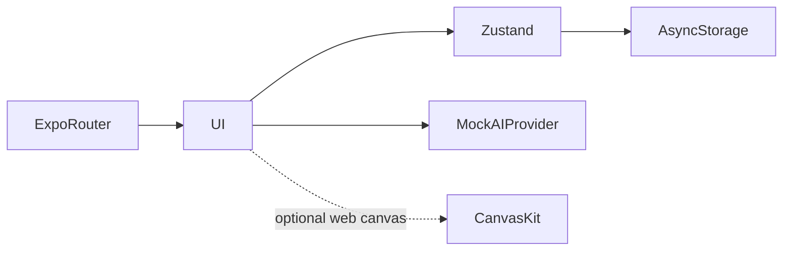
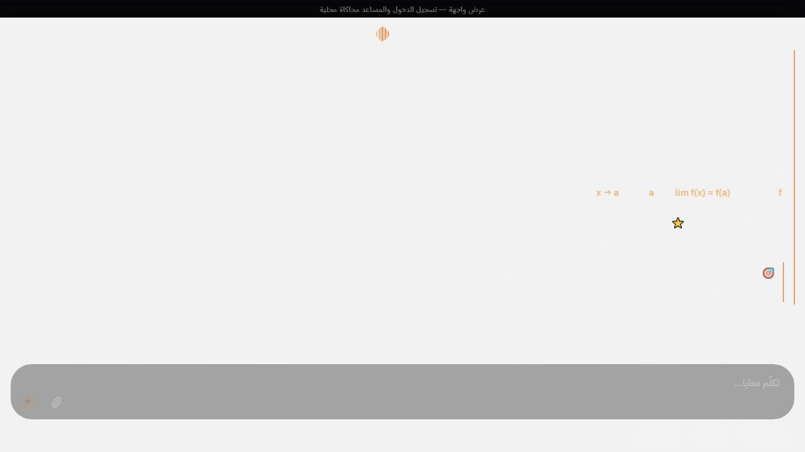

# BACUA

**واجهة تطبيق دراسة البكالوريا باللغة العربية**

[English](README.md)

تسهيل تصفح منهج البكالوريا الجزائرية وقراءة الدروس والمحادثات الدراسية ضمن واجهة هاتف عربية.

**التقنيات:** Expo 54 · React Native · TypeScript · Zustand · Skia

## الحالة والتاريخ

تطبيق واجهة مصمم بعناية. المصادقة وإجابات المساعد محاكاة؛ لا يُفترض وجود خدمة ذكاء اصطناعي منشورة.

هذه نسخة عرض منقحة للنشر. تعرض [وثيقة التحقق](docs/verification.ar.md) الفحوص الحالية بصورة مستقلة عن النشر السابق.

## الوظائف والإجراءات

- تهيئة واختيار الشعبة الدراسية
- تصفح المواد والوحدات والدروس مع تقدم القراءة
- نقل سياق الدرس إلى مساعد محاكى بإجابات متدرجة
- حفظ المحادثات وإلغاء الإجابة والتفضيلات المحلية
- RTL صريح وخط عربي وحركة وإعداد تقليل الحركة
- تهيئة Skia وCanvasKit وسلوك بديل

اختيار شعبة ← فتح مادة ودرس ← تسجيل التقدم ← نقل سياق الدرس للمحادثة ← استقبال أو إلغاء جواب محاكى ← استعادة الحالة المحلية بعد إعادة التشغيل.

## البنية

## القرارات الهندسية

- يفصل عقد AIProvider الواجهة عن مزود نموذج مستقبلي. وزن الكلمات والمواد سلوك تجريبي وليس استرجاعاً أو استدلالاً.
- يسمح الحفظ المحلي باستمرار الجلسات دون اختراع خادم. إعادة ضبط التخزين تحذف السجلات المحلية.
- حُفظ Expo 54 لتجنب مزج إعداد النشر بترحيل إطار العمل. يسهل تصدير الويب تقييم الواجهة.
- RTL قرار تخطيط في كامل الواجهة وليس ترجمة النصوص فقط.

## المجلدات

| المكون | المسؤولية |
|---|---|
| `app/` | شاشات Expo Router |
| `src/` | الحالة والمنهج والمساعد المحاكى ووحدات الواجهة |
| `index.web.js` | مدخل تهيئة الويب |
| `assets/` | الخطوط والأصول المرئية |

## التثبيت والإعداد

ثبّت باستخدام `npm ci` ثم شغّل `npm start` أو `npm run web`. افحص الأنواع عبر `npm run typecheck` وصدّر الويب عبر `npm run build:web`. لا تتطلب المصادقة أو الإجابات المحاكية بيانات خادم. قدم `dist/` عبر HTTP.

توجد أوامر التشغيل ومتغيرات البيئة في [دليل الإعداد](docs/setup.ar.md). القيم أمثلة محلية أو حقول فارغة؛ لا تعِد استخدام بيانات إنتاج سابقة.

## العرض والتحقق

اختيار شعبة ← فتح مادة ودرس ← تسجيل التقدم ← نقل سياق الدرس للمحادثة ← استقبال أو إلغاء جواب محاكى ← استعادة الحالة المحلية بعد إعادة التشغيل.

استخدم حسابات وسجلات اصطناعية. راجع [خطوات العرض](docs/demo.ar.md) وسجل نتائج الفحوص الحالية. نجاح بناء مكون لا يثبت نجاح كل مسارات المنتج.

## الحدود

المصادقة وإجابات المساعد محاكاة محلية. البديل الافتراضي هو مسار العرض المدعوم؛ تفعيل EXPO_PUBLIC_ENABLE_SKIA_WEB=1 يختار CanvasKit غير المفحوص مستقلاً. لا ندعي نموذجاً حقيقياً أو أمان حساب بعيد أو مزامنة أجهزة.

## التوثيق

- [البنية](docs/architecture.ar.md)
- [الإعداد](docs/setup.ar.md)
- [العرض](docs/demo.ar.md)
- [المسارات](docs/api.ar.md)
- [الفحوص الحالية](docs/verification.ar.md)
- [النشر وحل المشكلات](docs/deployment.ar.md)
- [حقوق الأصول](THIRD_PARTY_NOTICES.md)

## المساهمة والترخيص

افتح مشكلة تتضمن خطوات إعادة الإنتاج والمكون المعني. استخدم بيانات اصطناعية وتعديلات مركزة وفحوصاً مناسبة، ولا ترسل أسراراً أو سجلات مستخدمين خاصة. الشيفرة بترخيص [MIT](LICENSE)، وتحتفظ الاعتماديات والأصول الخارجية بشروطها الأصلية.

<!-- release-presentation -->

## من التطبيق الفعلي

هذه لقطة فعلية للواجهة المحلية، وليست دليلاً على استخدام إنتاجي أو فحص أندرويد.

## التحقق والقراءة المتعمقة

نجح فحص الأنواع وتصدير Expo الثابت للويب. أمكن أن يدخل محلل Markdown في حلقة لا تنتهي عند وصول عنوان جدول جزئي أثناء البث؛ أُصلح وأضيفت فحوص لكل بادئة. يستخدم عرض الويب البديل الموجود دون Skia. نجح إكمال الرد المحاكى واستعادة المحادثة بعد التحديث والإلغاء. تبقى المصادقة محاكاة ويوضح شريط العرض ذلك. فحص الأجهزة ومسار CanvasKit الاختياري منفصلان ولم يكتملَا.

المصادقة وإجابات المساعد محاكاة محلية. البديل الافتراضي هو مسار العرض المدعوم؛ تفعيل EXPO_PUBLIC_ENABLE_SKIA_WEB=1 يختار CanvasKit غير المفحوص مستقلاً. لا ندعي نموذجاً حقيقياً أو أمان حساب بعيد أو مزامنة أجهزة.

- [دراسة المشروع](docs/case-study.ar.md)
- [التحقق](docs/verification.ar.md)
- [مخطط البنية](docs/architecture.svg)
- [صفحة المشروع](https://mohamed-abderrehmane-portfolio.wry-dog-0796.chatgpt.site/ar/projects/bacua/)
