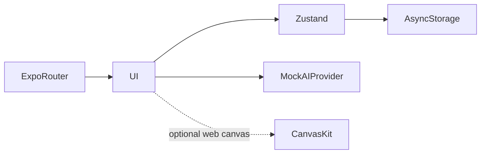

# BACUA

**واجهة تطبيق دراسة البكالوريا باللغة العربية**

[English](README.md)

تسهيل تصفح منهج البكالوريا الجزائرية وقراءة الدروس والمحادثات الدراسية ضمن واجهة هاتف عربية.

**التقنيات:** Expo 54 · React Native · TypeScript · Zustand · Skia

## الحالة والتاريخ

تطبيق واجهة مصمم بعناية. المصادقة وإجابات المساعد محاكاة؛ لا يُفترض وجود خدمة ذكاء اصطناعي منشورة.

هذه نسخة عرض منقحة للنشر. تعرض [وثيقة التحقق](docs/verification.md) الفحوص الحالية بصورة مستقلة عن النشر السابق.

## الوظائف والإجراءات

- تهيئة واختيار الشعبة الدراسية
- تصفح المواد والوحدات والدروس مع تقدم القراءة
- نقل سياق الدرس إلى مساعد محاكى بإجابات متدرجة
- حفظ المحادثات وإلغاء الإجابة والتفضيلات المحلية
- RTL صريح وخط عربي وحركة وإعداد تقليل الحركة
- تهيئة Skia وCanvasKit وسلوك بديل

اختيار شعبة ← فتح مادة ودرس ← تسجيل التقدم ← نقل سياق الدرس للمحادثة ← استقبال أو إلغاء جواب محاكى ← استعادة الحالة المحلية بعد إعادة التشغيل.

## البنية

## القرارات الهندسية

- يفصل عقد AIProvider الواجهة عن مزود نموذج مستقبلي. وزن الكلمات والمواد سلوك تجريبي وليس استرجاعاً أو استدلالاً.
- يسمح الحفظ المحلي باستمرار الجلسات دون اختراع خادم. إعادة ضبط التخزين تحذف السجلات المحلية.
- حُفظ Expo 54 لتجنب مزج إعداد النشر بترحيل إطار العمل. يسهل تصدير الويب تقييم الواجهة.
- RTL قرار تخطيط في كامل الواجهة وليس ترجمة النصوص فقط.

## المجلدات

| Component | Responsibility |
|---|---|
| `app/` | Expo Router screens |
| `src/` | State, curriculum, mock AI and shared interface modules |
| `index.web.js` | Web initialization entry |
| `assets/` | Fonts and visual assets |

## التثبيت والإعداد

ثبّت باستخدام `npm ci` ثم شغّل `npm start` أو `npm run web`. افحص الأنواع عبر `npm run typecheck` وصدّر الويب عبر `npm run build:web`. لا تتطلب المصادقة أو الإجابات المحاكية بيانات خادم. قدم `dist/` عبر HTTP.

توجد أوامر التشغيل ومتغيرات البيئة في [دليل الإعداد](docs/setup.ar.md). القيم أمثلة محلية أو حقول فارغة؛ لا تعِد استخدام بيانات إنتاج سابقة.

## العرض والتحقق

اختيار شعبة ← فتح مادة ودرس ← تسجيل التقدم ← نقل سياق الدرس للمحادثة ← استقبال أو إلغاء جواب محاكى ← استعادة الحالة المحلية بعد إعادة التشغيل.

استخدم حسابات وسجلات اصطناعية. راجع [خطوات العرض](docs/demo.ar.md) وسجل نتائج الفحوص الحالية. نجاح بناء مكون لا يثبت نجاح كل مسارات المنتج.

## الحدود

واجهة فقط؛ الحسابات والأجوبة محاكاة. النموذج الحقيقي والاسترجاع والمزامنة وأمن الحسابات ضمن خارطة الطريق.

## التوثيق

- [البنية](docs/architecture.ar.md)
- [الإعداد](docs/setup.ar.md)
- [العرض](docs/demo.ar.md)
- [المسارات](docs/api.md)
- [الفحوص الحالية](docs/verification.md)
- [النشر وحل المشكلات](docs/deployment.md)
- [حقوق الأصول](THIRD_PARTY_NOTICES.md)

## المساهمة والترخيص

افتح مشكلة تتضمن خطوات إعادة الإنتاج والمكون المعني. استخدم بيانات اصطناعية وتعديلات مركزة وفحوصاً مناسبة، ولا ترسل أسراراً أو سجلات مستخدمين خاصة. الشيفرة بترخيص [MIT](LICENSE)، وتحتفظ الاعتماديات والأصول الخارجية بشروطها الأصلية.
