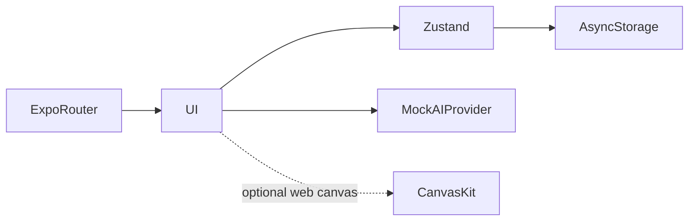

# BACUA

**An Algerian BAC study app frontend**

[العربية](README.ar.md)

An Algerian BAC study frontend for curriculum navigation, lesson reading and contextual study conversations.

**Technology:** Expo 54 · React Native · TypeScript · Zustand · Skia

## Status and deployment history

Designed frontend application. Authentication and assistant replies are mocked; there is no deployed AI service implied.

This is a sanitized portfolio release. See the current [verification record](docs/verification.md) before choosing a runtime demonstration.

## Main workflows and implemented features

- Onboarding and academic stream selection
- Subject/unit/lesson navigation with reading progress
- Lesson context handed to a streaming mock assistant
- Conversation persistence, cancellation and local preferences
- Explicit RTL, Arabic typography, animation and reduced-motion settings
- Skia/CanvasKit initialization with fallback behavior

Choose a stream → open a subject and lesson → mark progress → hand lesson context to chat → receive/cancel a mock streamed reply → restore local state after restart.

## Architecture

## Engineering decisions

- The AIProvider contract separates the interface from an eventual model provider. Keyword and subject weighting are demo behavior, not retrieval or inference.
- Local persistence makes the prototype useful across sessions without inventing a backend. Resetting storage removes those records.
- Keeping Expo 54 avoids combining release documentation with a framework migration. Web export gives reviewers a lower-friction way to inspect the interface.
- RTL is a layout decision throughout the UI, rather than a translated string layer alone.

## Directory guide

| Component | Responsibility |
|---|---|
| `app/` | Expo Router screens |
| `src/` | State, curriculum, mock AI and shared interface modules |
| `index.web.js` | Web initialization entry |
| `assets/` | Fonts and visual assets |

## Installation

Install with `npm ci`. Start using `npm start`, web with `npm run web`, check types with `npm run typecheck`, and export web with `npm run build:web`. No server credentials are required for mock authentication or assistant replies. Serve exported `dist/` over HTTP; do not open it as file URLs.

All required/private configuration is described in [setup](docs/setup.md). Examples contain placeholders or local demo values. Never reuse historical credentials.

## Demonstration

- Complete onboarding and choose an academic stream.
- Read a lesson, mark progress and open contextual chat.
- Cancel a streamed mock answer and reload to inspect persistence.
- Check a narrow viewport, reduced motion and reset behavior.

## Verification and limitations

- TypeScript check
- Expo web export
- Persistence and cancellation
- Narrow-screen and reduced-motion behavior

Frontend only. Accounts and responses are simulated; live LLM, retrieval, synchronization and real account security are roadmap work.

## Documentation

- [Architecture](docs/architecture.md) · [العربية](docs/architecture.ar.md)
- [Setup and configuration](docs/setup.md) · [العربية](docs/setup.ar.md)
- [Demo walkthrough](docs/demo.md) · [العربية](docs/demo.ar.md)
- [API and execution paths](docs/api.md)
- [Verification record](docs/verification.md)
- [Deployment and troubleshooting](docs/deployment.md)
- [Asset attribution](THIRD_PARTY_NOTICES.md) · [MIT license](LICENSE)

## Contributing

Open an issue describing a reproducible problem, expected behavior and component involved. Use synthetic data. Keep changes focused and include relevant checks. Do not include credentials or private user records.

## License and attribution

Source code is MIT licensed. Third-party dependencies and assets retain their own terms; see [attribution](THIRD_PARTY_NOTICES.md).

<!-- release-presentation -->

## Verification and deeper reading

Type checking and static Expo web export passed. An incremental Markdown parser could loop forever on a partial table header during streaming; its pure parser now has prefix regression checks. The default web preview uses the existing non-Skia fallback. Browser checks passed completed mock replies, conversation restoration after refresh and cancellation. Mock sign-in and the visible demonstration label are retained. Native device and opt-in CanvasKit verification are separate remaining checks.

Authentication and assistant responses are local mocks. The default browser fallback is the supported demonstration path; enabling EXPO_PUBLIC_ENABLE_SKIA_WEB=1 opts into a separately unverified CanvasKit path. No real AI, remote account security or cross-device synchronization is claimed.

- [Case study](docs/case-study.md)
- [Verification](docs/verification.md)
- [Architecture diagram](docs/architecture.svg)
- [Portfolio case study](https://mohamed-abderrehmane-portfolio.hillock-factual9mupt.chatgpt.site/projects/bacua/)

- [Engineering details and implementation lessons](docs/engineering-notes.md)
