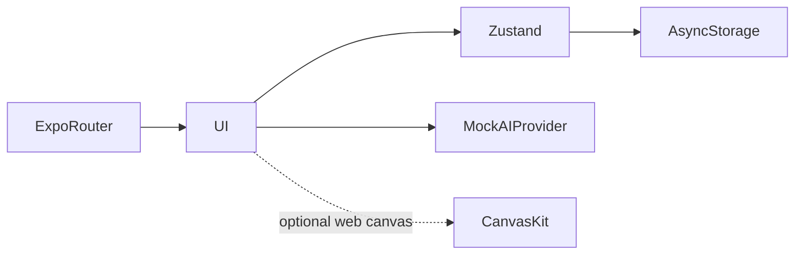

# بنية BACUA

اختيار شعبة ← فتح مادة ودرس ← تسجيل التقدم ← نقل سياق الدرس للمحادثة ← استقبال أو إلغاء جواب محاكى ← استعادة الحالة المحلية بعد إعادة التشغيل.

## القرارات والمفاضلات

- يفصل عقد AIProvider الواجهة عن مزود نموذج مستقبلي. وزن الكلمات والمواد سلوك تجريبي وليس استرجاعاً أو استدلالاً.
- يسمح الحفظ المحلي باستمرار الجلسات دون اختراع خادم. إعادة ضبط التخزين تحذف السجلات المحلية.
- حُفظ Expo 54 لتجنب مزج إعداد النشر بترحيل إطار العمل. يسهل تصدير الويب تقييم الواجهة.
- RTL قرار تخطيط في كامل الواجهة وليس ترجمة النصوص فقط.

## مراجع الشيفرة

- [package.json](../package.json)
- [index.web.js](../index.web.js)

## الحدود

واجهة فقط؛ الحسابات والأجوبة محاكاة. النموذج الحقيقي والاسترجاع والمزامنة وأمن الحسابات ضمن خارطة الطريق.
