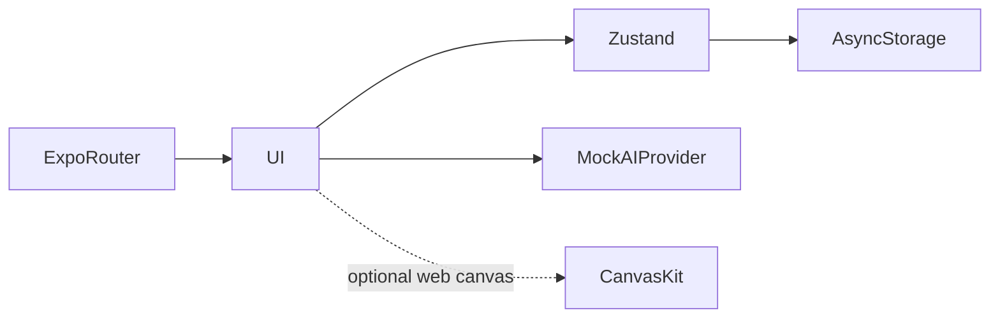

# BACUA architecture

Choose a stream → open a subject and lesson → mark progress → hand lesson context to chat → receive/cancel a mock streamed reply → restore local state after restart.

## Decisions and tradeoffs

- The AIProvider contract separates the interface from an eventual model provider. Keyword and subject weighting are demo behavior, not retrieval or inference.
- Local persistence makes the prototype useful across sessions without inventing a backend. Resetting storage removes those records.
- Keeping Expo 54 avoids combining release documentation with a framework migration. Web export gives reviewers a lower-friction way to inspect the interface.
- RTL is a layout decision throughout the UI, rather than a translated string layer alone.

## Component boundaries

| Component | Responsibility |
|---|---|
| `app/` | Expo Router screens |
| `src/` | State, curriculum, mock AI and shared interface modules |
| `index.web.js` | Web initialization entry |
| `assets/` | Fonts and visual assets |

## Source evidence

- [package.json](../package.json)
- [index.web.js](../index.web.js)

## Limits

Frontend only. Accounts and responses are simulated; live LLM, retrieval, synchronization and real account security are roadmap work.
